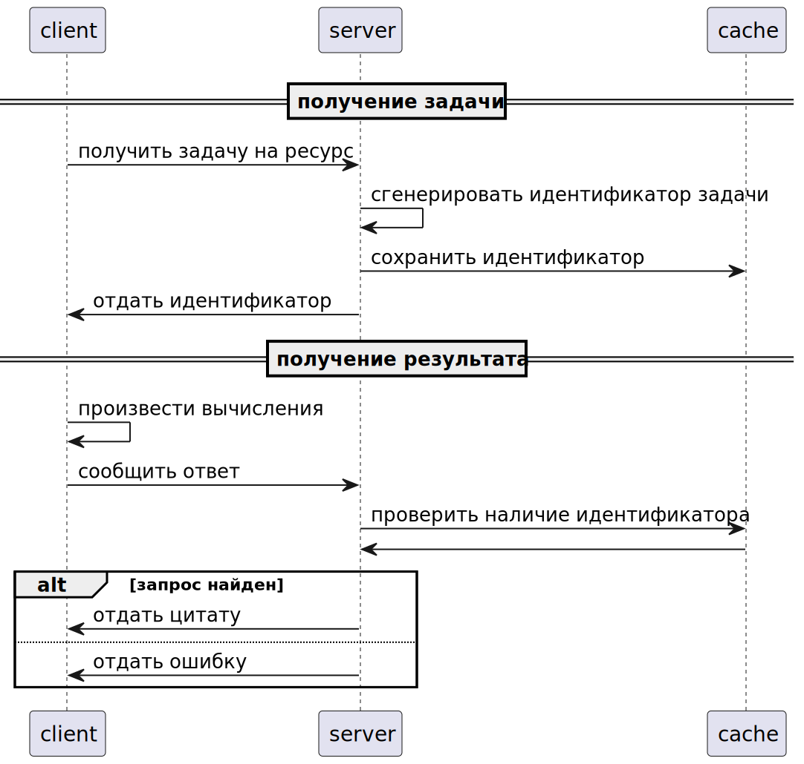

# Тестовое задание - TCP сервер с цитатами

## 1. Запуск в докере
`docker-compose up -d`

## 2. Запуск локально

`go run server.go`

`go run client.go`

Вся конфигурация хранится в `config.yaml` файле.

## 3. Описание задания (из telegram)
Design and implement “Word of Wisdom” tcp server. 
TCP server should be protected from DDOS attacks with the [Proof of Work](https://en.wikipedia.org/wiki/Proof_of_work), 
the challenge-response protocol should be used.  
The choice of the PoW algorithm should be explained.  
After Prof Of Work verification, server should send one of the quotes from “word of wisdom” book or any other collection of the quotes.  
Docker file should be provided both for the server and for the client that solves the PoW challenge.


### 4 Описание результата

Результат представляет собой 2 приложения - один сервер, другой клиент. 
Протокол общения выбран TCP, первой строкой идет тип сообщения, далее запрашиваемый ресурс, далее payload. Разделителем используется перевод строки.
Клиент запрашивает ресурс - случайно сгенерированный набор символов. Сервер запоминает ресурс в кэше redis. Выдает задание. Клиент решает задание и посылает результат.

### Диаграмма последовательности



```plantuml
participant client 
participant server
participant cache


== получение задачи ==

client -> server: получить задачу на ресурс
server -> server : сгенерировать идентификатор задачи
server -> cache : сохранить идентификатор
server -> client: отдать идентификатор

== получение результата ==
client ->client : произвести вычисления
client -> server : сообщить ответ
server -> cache : проверить наличие идентификатора
cache -> server :
alt запрос найден
server -> client : отдать цитату
else 
server -> client : отдать ошибку
end
```

В качестве алгоритма выбран [HashCash](https://en.wikipedia.org/wiki/Hashcash) как наиболее поддающийся конфигурации сложности, а так же имеющий наибольшую поддержку среди готового кода на github.
В качестве альтернативы рассматривались пазлы, mbound алгоритм, выполнение произвольного кода по времени, подсчет квадратов и т.п. со страницы в википедии.
Цитаты "подтягиваются" с online api [https://dummyjson.com/quotes/random](https://dummyjson.com/quotes/random)